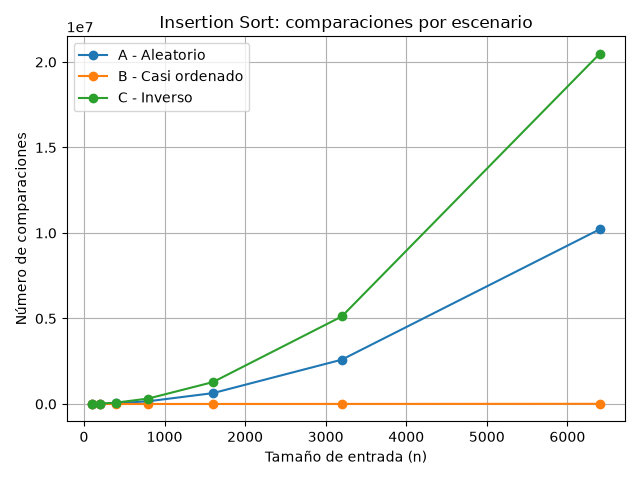
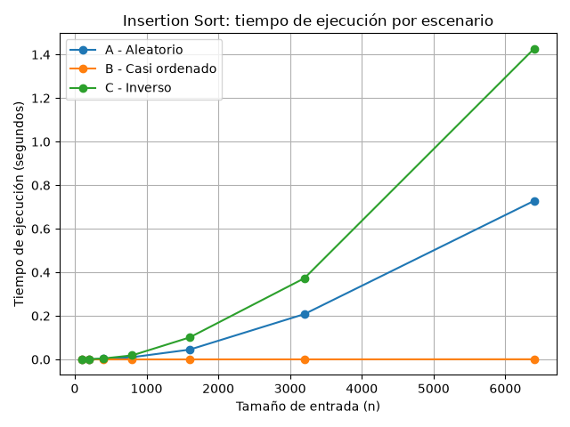

# Laboratorio evaluativo 01 — Fundamentos, complejidad y recurrencias

**Estudiante:** Ana María Colorado Varela

## Contenido
* [Instrucciones de reproducción](#instrucciones-de-reproducción)
* [Activar el entorno](#activar-el-entorno)
* [Parte 1 — Analizar el algoritmo antes de cambiar hardware](#parte-1--analizar-el-algoritmo-antes-de-cambiar-hardware)
* [Parte 2 — Responsabilidad ambiental y ética](#parte-2--responsabilidad-ambiental-y-ética)
* [Parte 3 — Casos de entrada](#parte-3--casos-de-entrada)
  * [3.1 Mejor, peor y caso promedio](#31-mejor-peor-y-caso-promedio)
  * [3.2 Demostración experimental](#32-demostración-experimental)

* [Parte 4 — Complejidad y validación](#parte-4--complejidad-y-validación)
---

## Instrucciones de reproducción

Este laboratorio analiza el comportamiento del algoritmo de ordenamiento utilizado por la plataforma Tamiza y compara experimentalmente diferentes escenarios de entrada.

Los experimentos y algoritmos implementados se encuentran en los archivos:

- [algoritmos.py](algoritmos.py)
- [datos.py](datos.py)
- [parte3_casos.py](parte3_casos.py)
- [parte4_complejidad.py](parte4_complejidad.py)

---

## Activar el entorno
### 1. Ubicación del proyecto

Desde WSL o su entorno de preferencia, ingresar al repositorio:

``` bash
cd ~/curso-analisis-algoritmos/lab1-fundamentos-complejidad-recurrencias
```

### 2. Activar el entorno virtual

El entorno virtual utilizado para el curso se encuentra en .venv. Desde el directorio del laboratorio, activarlo con:

``` bash
source ../.venv/bin/activate
```

Una vez activado, la terminal debe mostrar (.venv) al inicio de la línea.

### 3. Ejecutar los experimentos

Con el entorno virtual activo, los archivos pueden ejecutarse utilizando Python:

``` bash
python parte3_casos.py
```
y:
``` bash
python parte4_complejidad.py
```

Las gráficas generadas por los experimentos se almacenan en la carpeta ``` graficas/.```

### 4. Desactivar el entorno

Al finalizar, el entorno virtual puede desactivarse con:
``` bash
deactivate
```
---

# Parte 1 — Analizar el algoritmo antes de cambiar hardware
En la plataforma Tamiza es necesario diferenciar entre la corrección de un algoritmo y su eficiencia. La corrección se refiere a que los registros queden ordenados correctamente de acuerdo con su índice de riesgo, en este caso de mayor a menor. Sin embargo, obtener un resultado correcto no es suficiente para cumplir con las necesidades del sistema. También existe una restricción temporal, los 1.200.000 registros pendientes deben ser procesados durante la ventana nocturna comprendida entre las 2:00 am y las 6:00 am, de manera que la lista esté disponible cuando inicie el trabajo del centro de contacto.

El problema observado en las últimas semanas muestra que esta restricción de tiempo está siendo incumplida, ya que la lista no siempre queda completamente ordenada antes de las 6:00 am, esto significa que, el problema no debe analizarse únicamente desde la capacidad del servidor, sino que también debe analizarse desde la cantidad de trabajo que realiza el algoritmo a medida que aumenta el número de registros.

La propuesta de utilizar un servidor con el doble de velocidad podría disminuir el tiempo de una ejecución determinada, pero no modifica la forma en la que crece el trabajo del algoritmo cuando aumenta el tamaño de la entrada. Si el volumen de registros continúa creciendo, el mismo algoritmo puede volver a superar las cuatro horas disponibles, por esta razón, antes de aumentar únicamente la capacidad del hardware es necesario analizar el comportamiento del algoritmo y determinar si su crecimiento es adecuado para el volumen de datos que deben procesar.

Un ejemplo que viví en mi ambiente laboral fue la optimización de un proceso de match_phrases, encargado de comparar frases y encontrar coincidencias entre textos. Inicialmente utilizábamos `SequenceMatcher`, pero al aumentar la cantidad de frases que debían compararse, el proceso se volvía considerablemente lento porque debía realizar muchas comparaciones de cadenas. Para solucionarlo reemplazamos esta implementación por `RapidFuzz`, que utiliza algoritmos de similitud de cadenas más optimizados y una implementación en C++ para ejecutar las operaciones de comparación con menor costo. 

Esto permitió realizar las comparaciones de frases de forma mucho más rápida y redujo considerablemente el tiempo total de ejecución del proceso. Esta experiencia nos mostró que, ante un aumento importante en la cantidad de datos, cambiar la implementación utilizada puede tener un impacto significativo en el rendimiento sin necesidad de solucionar el problema únicamente aumentando los recursos del servidor.

---
# Parte 2 — Responsabilidad ambiental y ética

El tiempo de ejecución de un algoritmo también puede tener un impacto ambiental. En el caso de Tamiza, el proceso debe ejecutarse todas las noches sobre una cantidad considerable de registros, por lo que un algoritmo que tarde más tiempo mantiene los recursos del servidor trabajando durante más tiempo y puede generar un mayor consumo de energía. Aunque la diferencia de una sola ejecución pueda parecer pequeña, al repetirse diariamente durante meses o años, este consumo puede acumularse, por esto, mejorar el rendimiento de un proceso también significa hacer un uso más responsable de los recursos computacionales.

También existen consecuencias para las personas que dependen del resultado del proceso, un primer afectado sería el paciente, ya que el orden de la lista determina la prioridad con la que se realizan las llamadas. Si los registros no quedan correctamente ordenados o el proceso no termina antes de las 6:00 am, un paciente con un índice de riesgo alto podría ser contactado después de otros pacientes que deberían tener una prioridad menor. En este caso, el costo lo asumiría el paciente por una posible demora en el contacto y en el seguimiento que necesita.

Otro afectado sería el operador del centro de contacto, si la lista no está disponible al comenzar la jornada, los operadores podrían tener que esperar, reorganizar información manualmente o trabajar con una lista incompleta. Esto representa tiempo perdido y una mayor carga de trabajo para ellos, además de trasladar el problema del sistema a las personas que deben utilizarlo.

En Tamiza, por lo tanto, no basta con que el algoritmo termine dentro de las cuatro horas disponibles. La corrección del orden también es sumamente importante, porque el resultado determina quién recibe primero la atención del centro de contacto. Una solución adecuada debe mantener ambas condiciones del problema mencionado en el texto, producir una lista correctamente ordenada y hacerlo dentro del tiempo establecido.

---
# Parte 3 — Casos de entrada

## 3.1 Mejor, peor y caso promedio
Para un tamaño fijo de entrada `n`, el mejor caso corresponde a la entrada que requiere la menor cantidad de trabajo para que el algoritmo termine, mientras que el peor caso corresponde a la entrada que requiere la mayor cantidad de trabajo. El caso promedio representa el comportamiento esperado al considerar las diferentes entradas posibles de ese mismo tamaño.

Para Tamiza, la situación más importante para garantizar el cumplimiento de la ventana de 2:00 am a 6:00 am es el peor caso, porque el proceso debe estar preparado para terminar dentro de las cuatro horas incluso cuando los datos requieran la mayor cantidad de trabajo. Analizar únicamente un caso favorable podría dar una estimación demasiado alejada del tiempo necesario en producción.

Antes de realizar las mediciones, se establece la siguiente predicción para el comportamiento de `insertion sort`:

| Escenario | Tipo de entrada | Predicción    |
| --------- | --------------- | ------------- |
| A         | Aleatorio       | Caso promedio |
| B         | Casi ordenado   | Mejor caso    |
| C         | Inverso         | Peor caso     |

El escenario B se espera como el mejor caso porque el 98% de los registros ya estaría en el orden requerido por el algoritmo y solamente una pequeña parte necesitaría ser procesada. El escenario **C** se espera como el peor caso porque los registros estarían completamente en el orden contrario al requerido, obligando al algoritmo a realizar una mayor cantidad de desplazamientos y comparaciones. Finalmente, el escenario A, al no presentar una organización previa relacionada con el riesgo, se toma como aproximación al comportamiento promedio.

---
### 3.2 Demostración experimental
---
Para comprobar el comportamiento de insertion sort se ejecutó el algoritmo sobre los tres escenarios definidos por Tamiza: A, aleatorio; B, casi ordenado; y C, inverso. Se utilizaron siete tamaños de entrada: 100, 200, 400, 800, 1600, 3200 y 6400 registros. Cada medición se realizó tres veces y se utilizó el tiempo promedio de ejecución. El conteo de comparaciones corresponde únicamente a comparaciones entre elementos de la lista.

**Código utilizado:** [código de la Parte 3](parte3_casos.py), [algoritmos.py](algoritmos.py) y [datos.py](datos.py).

#### Comparaciones



La gráfica muestra una diferencia clara entre los tres escenarios. El escenario B, que corresponde a una entrada casi ordenada, presenta el menor número de comparaciones y su crecimiento es mucho más lento. En cambio, el escenario C, que llega exactamente en el orden contrario al requerido, presenta el mayor número de comparaciones y crece aproximadamente de forma cuadrática. El escenario A queda entre ambos y representa el comportamiento esperado para una entrada aleatoria.

Para `n = 6400`, el escenario B realizó 10.277 comparaciones, mientras que A realizó 10.212.827 y C llegó a 20.476.800. Esto muestra que la distribución de los datos tiene un efecto importante sobre el comportamiento de insertion sort.

#### Tiempo de ejecución



El comportamiento del tiempo sigue la misma tendencia general que el número de comparaciones. El escenario B mantiene tiempos muy bajos incluso cuando aumenta el tamaño de entrada, mientras que A y C crecen mucho más rápidamente. Para 6400 elementos, B tardó en promedio 0,000796 segundos, A 0,727944 segundos y C 1,426427 segundos.

Con estos resultados, el **escenario B corresponde al mejor caso**, el **escenario C al peor caso** y el **escenario A se aproxima al caso promedio**. Esto coincide con la predicción realizada antes del experimento. La razón es que insertion sort realiza muy poco trabajo cuando los elementos ya están en el orden requerido, mientras que debe realizar el máximo número de desplazamientos y comparaciones cuando la lista está completamente invertida.

